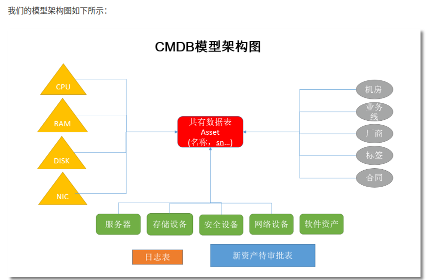

## 如何在 Django 中使用 pyecharts

Django 模板渲染模式

这里的django版本和官方介绍的不同。
本环境
django 4.1
pyecharts 1.9
python 3.10.6

[官网教程](https://pyecharts.org/#/zh-cn/web_django)

以下官网教程是不能在4.1 django 运行的，关注步骤即可，最终以本代码为准。


## Step 0: 新建一个 Django 项目
```bash
django-admin startproject pyecharts_django_demo
```
创建一个应用程序
```bash
python manage.py startapp demo
```
在 pyecharts_django_demo/settings.py 中注册应用程序

```bash
# pyecharts_django_demo/settings.py
INSTALLED_APPS = [
    'django.contrib.admin',
    'django.contrib.auth',
    'django.contrib.contenttypes',
    'django.contrib.sessions',
    'django.contrib.messages',
    'django.contrib.staticfiles',
    'demo'  # <---
]
```


编辑 demo/urls.py 文件
```bash
# demo/urls.py
from django.conf.urls import url

from . import views

urlpatterns = [
    url(r'^$', views.index, name='index'),
]

```
在 pyecharts_django_demo/urls.py 中新增 'demo.urls'

```bash
pyecharts_django_demo/urls.py
from django.conf.urls import include, url
from django.contrib import admin

urlpatterns = [
    url(r'^admin/', admin.site.urls),
    url(r'demo/', include('demo.urls'))  # <---
]
```
## Step 1: 拷贝 pyecharts 模板

先在 demo 文件夹下新建 templates 文件夹

```bash
chenjiandongx@DESKTOP-E83NUHA:/mnt/d/Python/pyecharts-django-demo/pyecharts_django_demo/demo$ ls
__init__.py  __pycache__  admin.py  apps.py  migrations  models.py  templates  tests.py  urls.py  views.py
```
将 pyecharts 模板，位于 pyecharts.render.templates 拷贝至刚新建的 templates 文件夹

```bash
chenjiandongx@DESKTOP-E83NUHA:/mnt/d/Python/pyecharts-django-demo/pyecharts_django_demo/demo/templates$ tree
.
├── jupyter_lab.html
├── jupyter_notebook.html
├── macro
├── nteract.html
├── simple_chart.html
├── simple_page.html
└── table.html
```

## Step 2: 渲染图表
将下列代码保存到 demo/views.py 中。

```bash
from jinja2 import Environment, FileSystemLoader
from pyecharts.globals import CurrentConfig
from django.http import HttpResponse

CurrentConfig.GLOBAL_ENV = Environment(loader=FileSystemLoader("./demo/templates"))

from pyecharts import options as opts
from pyecharts.charts import Bar


def index(request):
    c = (
        Bar()
        .add_xaxis(["衬衫", "羊毛衫", "雪纺衫", "裤子", "高跟鞋", "袜子"])
        .add_yaxis("商家A", [5, 20, 36, 10, 75, 90])
        .add_yaxis("商家B", [15, 25, 16, 55, 48, 8])
        .set_global_opts(title_opts=opts.TitleOpts(title="Bar-基本示例", subtitle="我是副标题"))
    )
    return HttpResponse(c.render_embed())
```
## Step 3: 运行项目
```bash
$ python manage.py runserver
```

## 运行有问题？
修改文件engine.py  pyecharts包里面的文件
```
#第二行为如下
from collections.abc import Iterable

```


cmdb模型图


一般Web框架的架构


Django的MTV模型组织，分别是models，views,Templates


学习地址：
[CMDB资产管理系统](https://www.liujiangblog.com/course/django/118)  内容有点旧，django 2.2的

基于Python的Web开发技术栈：


## 管理员帐号密码
http://127.0.0.1:8000/admin/
admin:admin